# Python API Homework - What's the Weather Like?

The purpose of this project was to analyze how weather changes at different levels of latitude. I pulled data from OpenWeatherMap API to assemble a datset on over 500 cities.

## Part I - WeatherPy

The following scatter plots are showcased:

* Temperature (F) vs. Latitude
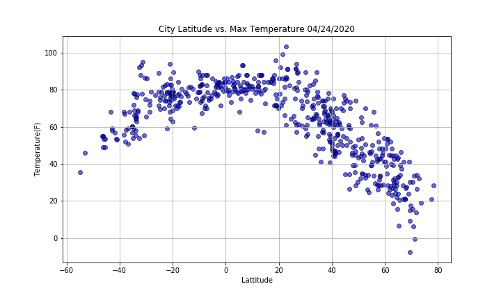
* Humidity (%) vs. Latitude
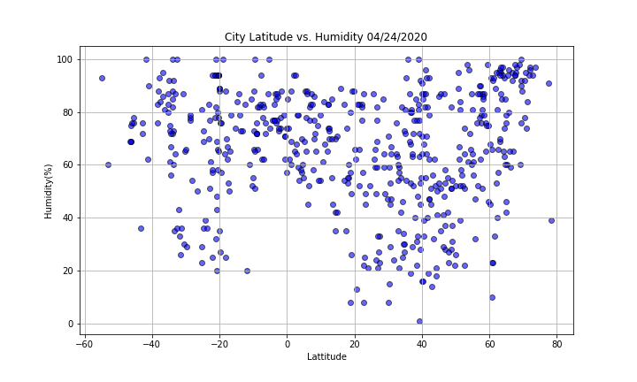
* Cloudiness (%) vs. Latitude
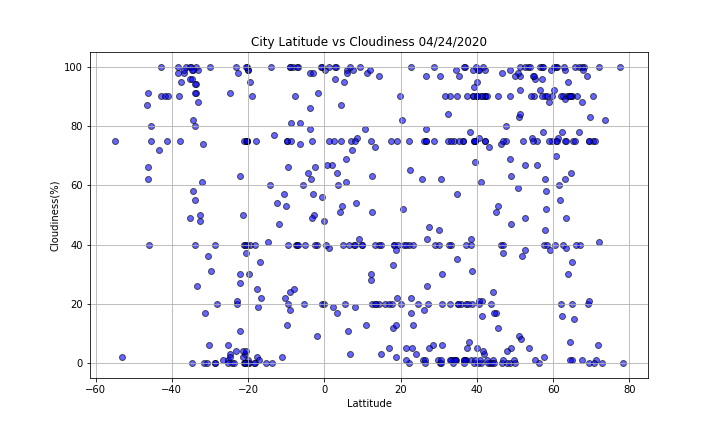
* Wind Speed (mph) vs. Latitude
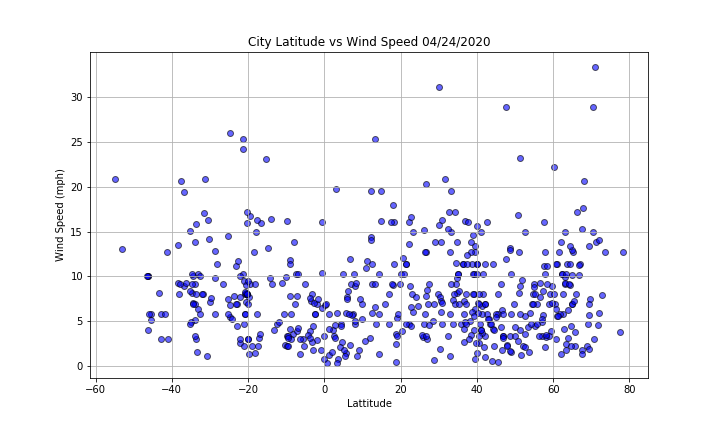

* Northern Hemisphere - Temperature (F) vs. Latitude
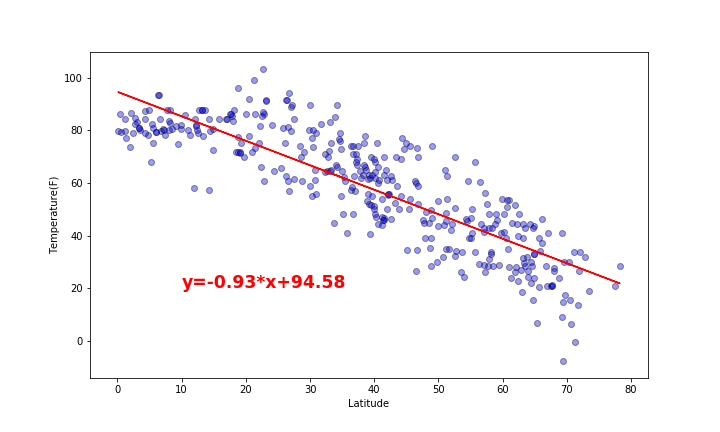
* Southern Hemisphere - Temperature (F) vs. Latitude

* Northern Hemisphere - Humidity (%) vs. Latitude
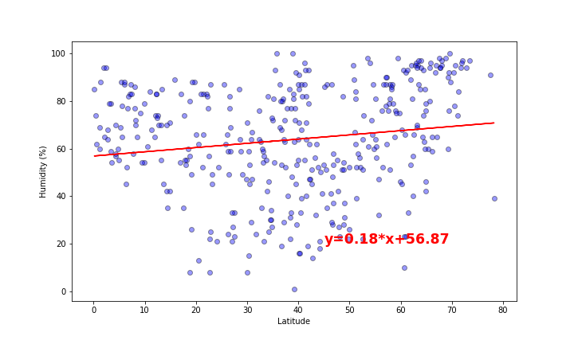
* Southern Hemisphere - Humidity (%) vs. Latitude
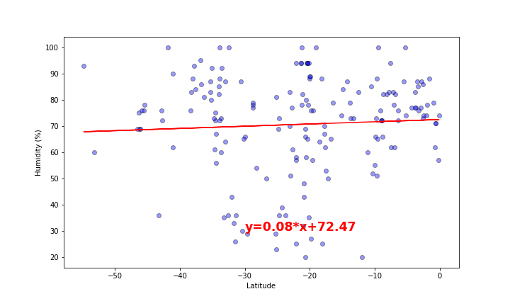
* Northern Hemisphere - Cloudiness (%) vs. Latitude
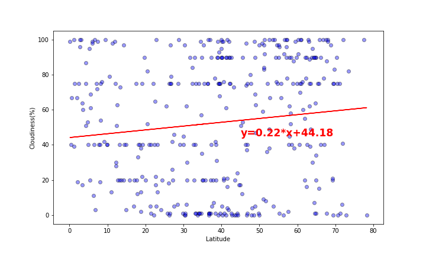
* Southern Hemisphere - Cloudiness (%) vs. Latitude
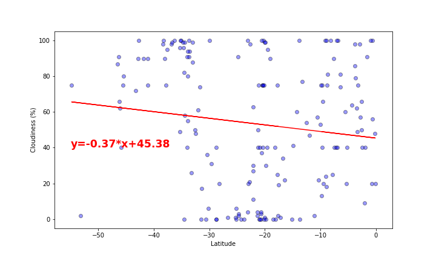
* Northern Hemisphere - Wind Speed (mph) vs. Latitude
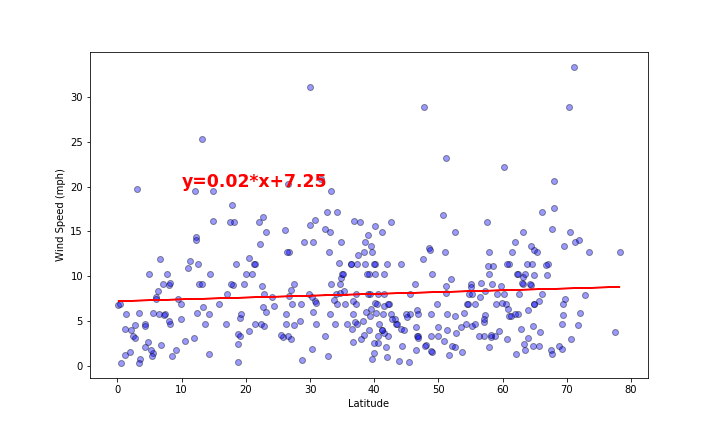
* Southern Hemisphere - Wind Speed (mph) vs. Latitude
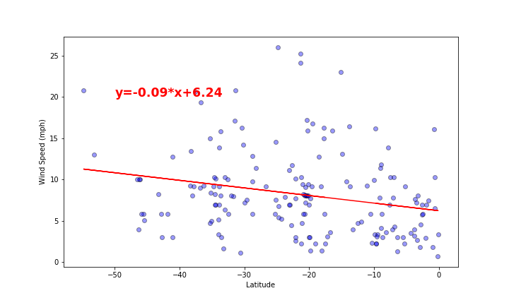

### Observations:
* Temperatures get higher as the city gets nearer to the equator (where latitude is 0).

* In the northern hemisphere, the latitude and temperature have negative correlation while in the southern hemisphere, the latitude and temperature have positive correlation.

* The cloudiness has a little correlation with the latitude. It seems that as the city gets further from the equator, the city gets more cloudy.

* Windspeed and latitude has no correlation, since the slope is nearly zero. Windspeed is not affected by the latitude.

## Part II - VacationPy

Jupyter-gmaps and the Google Places API were used to create a heat map for this part of the assignment.

* Create a heat map that displays the humidity for every city from the part I of the homework.

* Narrow down the DataFrame to find your ideal weather condition. For example:

  * A max temperature lower than 80 degrees but higher than 70.
  * Wind speed less than 10 mph.
  * Zero cloudiness.
  * Drop any rows that don't contain all three conditions. You want to be sure the weather is ideal.

* Using Google Places API to find the first hotel for each city located within 5000 meters of your coordinates.

* Plot the hotels on top of the humidity heatmap with each pin containing the **Hotel Name**, **City**, and **Country**.

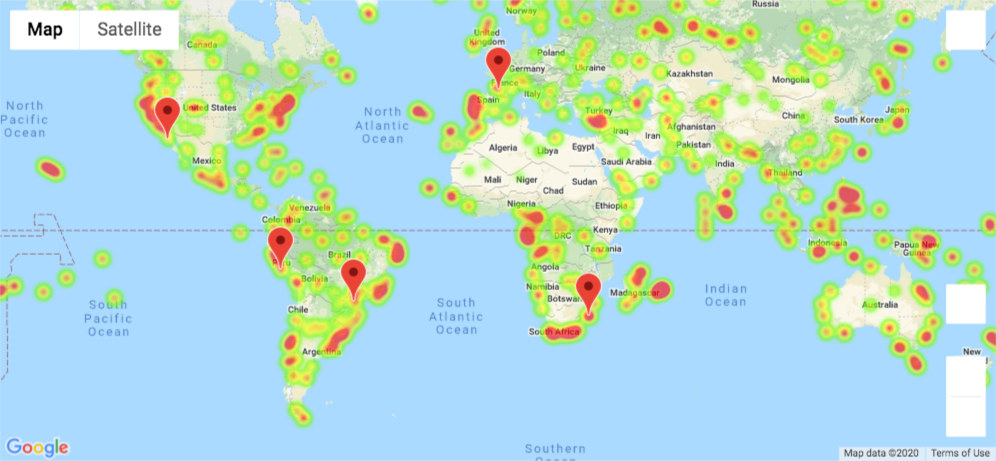
